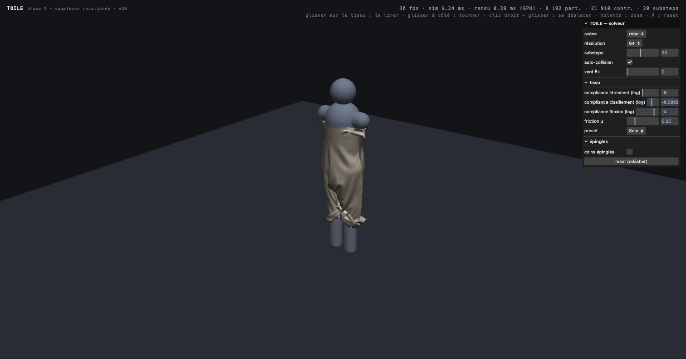
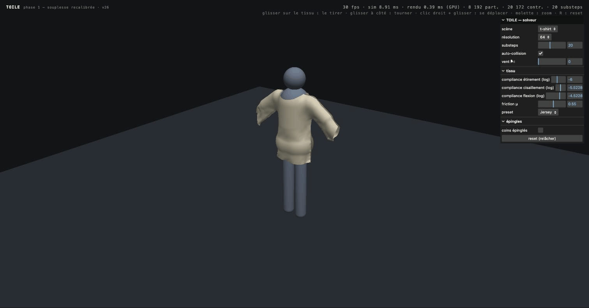
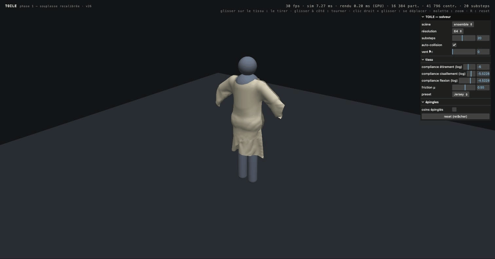

# TOILE

**Real-time cloth simulation engine for the web.**
XPBD solver running entirely on WebGPU compute shaders — zero CPU round-trips per frame.

<p align="center">
  
</p>

<p align="center">
  <b><a href="https://mondesirjessy-collab.github.io/toile/">▶ Live demo</a></b> — requires a WebGPU browser (Chrome/Edge 113+, Safari 26+, Firefox 141+)
</p>

TOILE (*French: the muslin test garment a pattern is validated on*) is the open engine at the core of a browser-based 3D garment design tool: an open, web-first alternative to proprietary desktop suites. The engine and the garment file format are free software; anyone can build on them.

> **Status: Phase 0 complete · Phase 1 (garment construction) essentially done.**
> The engine sews: pattern pieces are cut along smooth curves, seamed along
> their edges, and assembled onto a full mannequin — dress, kimono tee, or a
> layered tee-and-skirt outfit — with true dihedral bending, cloth
> self-collision and wind.

## Why

- **Proprietary lock-in.** Today's garment simulation tools trap patterns in closed formats and closed ecosystems. Fashion deserves an open interchange format the way the web got HTML.
- **Desktop-only.** Existing tools require heavy installs and per-seat licenses out of reach of independent designers, students and small labels.
- **The WebGPU window.** Modern browsers can now dispatch massively parallel compute. A cloth solver that needed a workstation in 2015 fits in a browser tab in 2026.

## What works today

- **XPBD cloth solver on GPU compute** — distance (structural + shear) and **true dihedral bending** (4-particle hinges), graph-colored for race-free parallel solving, 20 substeps per frame
- **Garment construction** — pattern pieces cut along smooth curves (A-line dress, kimono tee, flared skirt), stitched along their full boundary except declared openings (neckline, hem, cuffs), assembled live onto the body
- **Outfits** — several garments merged into one simulation; self-collision keeps the layers apart (tee over skirt)
- **Self-collision** — GPU spatial hash (atomic linked cells); folds slide instead of interpenetrating
- **Capsule colliders** — the mannequin (head, shoulders, torso, hips, legs, optional arms) is a handful of capsules
- **Wind** — gusty directional force on a live slider
- **Grab the fabric** — raycast picking with a temporary drag constraint; orbit/pan/zoom camera
- **Fabric presets** — Jersey / Denim / Silk: per-fabric stretch, shear, bending compliance, friction *and* look (face/back colors, sheen)
- **Live tuning** — five scenes (drape / sewing / dress / tee / outfit), mesh resolution 32/64/128, substeps, log-scale compliance sliders, friction, self-collision toggle
- **Perf HUD** — fps plus GPU-timestamped sim vs render times

| Silk dress | Kimono tee | Tee + skirt outfit |
|---|---|---|
|  |  |  |

## Controls

| Gesture | Action |
|---|---|
| Left-drag **on the fabric** | Grab and pull it |
| Left-drag on empty space | Orbit the camera |
| Right-drag | Pan |
| Wheel | Zoom |
| `R` | Drop the cloth again |
| `P` | Pin/release the two corners |

## Phase 0 success criteria

| # | Criterion | Threshold | Status |
|---|-----------|-----------|--------|
| S1 | 64×64 grid (4,096 particles) | ≥ 60 fps on recent integrated GPUs | ✅ ~1 ms/frame sim (Apple M-series) |
| S2 | 128×128 grid (16,384 particles) | ≥ 60 fps on mid-range discrete GPUs | ✅ ~3.5 ms/frame sim |
| S3 | Stability | No numerical explosion after 5 min, including under user interaction | ✅ |
| S4 | Cloth–sphere collision | No visible interpenetration | ✅ 0 penetrating particles (measured) |
| S5 | Drape realism | Side-by-side comparison with Blender cloth sim | ⏳ pending |
| S6 | Stretch control | ≤ 1% stretch under gravity (quasi-inextensible) | ✅ 0.76% measured |

Measured benchmarks and protocol live in [`/bench`](bench/README.md).

## Run it

```bash
npm install
npm run dev     # local demo at http://localhost:5173
npm test        # CPU unit tests (topology, graph coloring)
npm run bench   # CPU precompute benchmarks
```

## Architecture

```
src/engine/   ← the solver. Framework-free: exposes raw GPU buffers.
  solver/       XPBD passes (integrate → solve → collide → velocity) + WGSL shaders
  cloth/        grid topology, constraint building, graph coloring
src/app/      ← the demo. Rendering, camera, picking, UI.
```

The engine never imports a rendering framework. This boundary is what makes it publishable as a standalone package.

## Technical approach

- **XPBD** (Macklin, Müller, Chentanez 2016) with the *small steps* scheme (Müller et al. 2019): many substeps, one solver iteration each.
- **Graph coloring** for parallel constraint solving — one dispatch per color, all constraints in a color vertex-disjoint.
- **Single compute pass per frame** — all substep dispatches share one pass (WebGPU synchronizes storage writes between dispatches), cutting encoder overhead ~30% at 128².
- All simulation state lives in GPU storage buffers; the renderer reads positions directly and derives per-vertex normals in a small compute pass.

## Roadmap

- **Phase 0** — feasibility: stable interactive drape at 60 fps ✅
- **Phase 1** — garment construction: pattern seaming ✅, shaped pieces ✅, self-collision ✅, mannequin ✅, dihedral bending ✅, outfits ✅ — next: set-in sleeves (curved armhole seams)
- **Phase 2** — SMPL-X avatars, pattern editor, open community fabric library

## License

AGPL-3.0-only. If you run a modified version of this engine as a network service, you must publish your modifications. Commercial licensing inquiries are welcome.
